# Character movement tutorial

Welcome to the tutorial about character movement suited for beginners starting game development with Defold. You will start from a prepared project and make the stationary character move in all directions. The knowledge gathered here might be useful in both 2D and 3D top-down view games. 

## What you'll learn?

- Building Blocks: How collections, game objects, and components relate to each other
- Animations: How to new add animation groups to an atlas
- Input: How to capture key presses in a script, and add new bindings
- Logic: How to move a game object using vectors and `dt`, and switch animations based on movement direction
- Camera: How to follow character and zoom

This is a short tutorial, might take about 15 minutes to complete, but you can stay and play around with it more.

## Before you start

This tutorial requires no prior knowledge, but in order not to get lost inside the Defold Editor, check out the [Editor overview](https://defold.com/manuals/editor/) before.

This project already contains everything you need:

- character art and an atlas with an `idle` animation
- a background tilemap
- input bindings for `left`, `right`, `up`, and `down` key arrows on keyboard

## Try the game

Before beginning the tutorial, [build and run the project](defold://project.build) (<- by clicking this link) or use <kbd>Project</kbd> ▸ <kbd>Build</kbd> in the top menu or shortcut <kbd>Ctrl</kbd>+<kbd>B</kbd> (<kbd>Cmd</kbd>+<kbd>B</kbd> on Mac).

You should see a tiled background and a character staying in the middle of the screen. That is the starting point. Close the game.

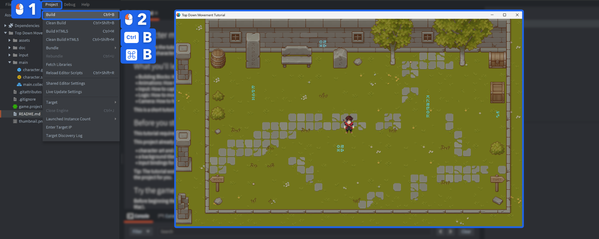

## Get familiar with the project

Open the ["/main/main.collection"](defold://open?path=/main/main.collection) - you can click here or click <kbd>Project</kbd> ▸ <kbd>Open</kbd> in the top menu or shortcut <kbd>Ctrl</kbd>+<kbd>P</kbd> (<kbd>Cmd</kbd>+<kbd>P</kbd> on Mac). This will open a popup where you can start typing the name of the file, you're looking for, so type "main" and double-click on the `main.collection` in the list (or select it and click <kbd>Open</kbd> button).

It will be opened in the main editor pane.

This is the **bootstrap** collection referenced from the project setting file: ["/game.project"](defold://open?path=/game.project). Defold loads it when the game starts.

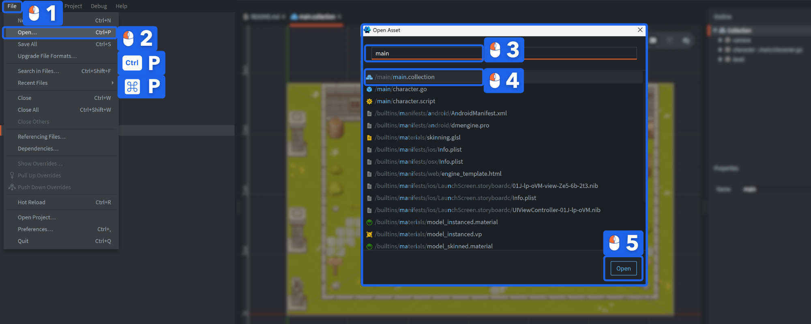

Tip: The tutorial works best, if the `README.md` file is opened inside the Defold editor, because the links in this document can open files directly in Defold and build the project for you. You can also split the view in half, by right-clicking on a tab and selecting <kbd>Move to Other Tab Pane</kbd>.

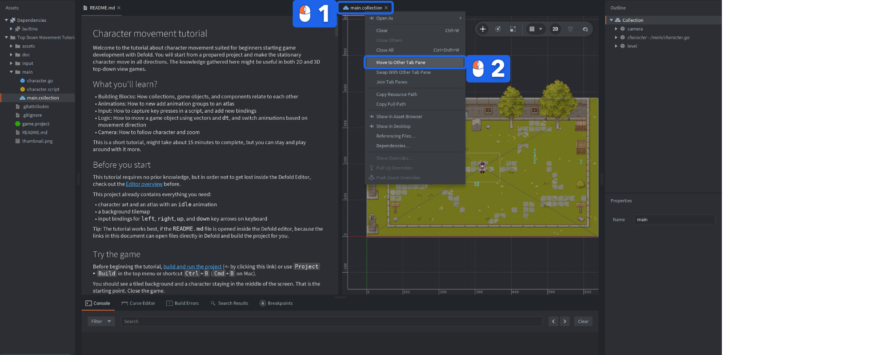

A few core terms will appear throughout the tutorial:

- <kbd>`Collection`</kbd>: a container for game objects and sub-collections.
- <kbd>`Game object`</kbd>: a plain simple object with transform (position, rotation, scale) that can hold components.
- <kbd>`Component`</kbd>: a piece of behavior or data such as a sprite, tilemap, or script.

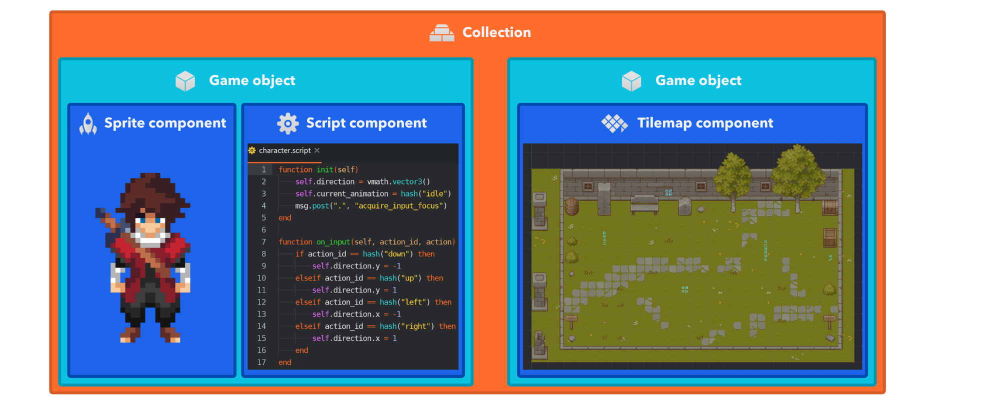

So `main.collection` is a file with all the game objects, that are spawned into the game's world. The components are part of game objects. You can see on the right site, in the <kbd>Outline</kbd> pane the root "Collection" and the tree-like structure of what's in it.

In this collection there are 3 game objects:

1. <kbd>`camera`</kbd>, an embedded game object with camera component to see the game's world
2. <kbd>`character`</kbd>, created from the blueprint file ["/main/character.go"](defold://open?path=/main/character.go).
3. <kbd>`level`</kbd>, an embedded game object with a tilemap component that uses ["/main/level.tilemap"](defold://open?path=/main/level.tilemap).

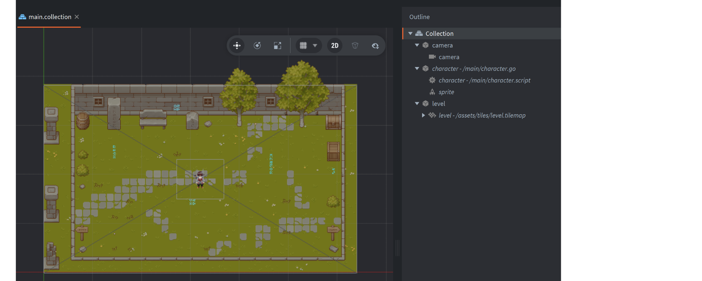

Using a blueprint file such as `character.go` makes an object reusable. Embedded objects (like the `camera` or `level`) are fine when you only need a single instance. You can read more about [Basic Building Blocks of Defold here](https://defold.com/manuals/building-blocks/).

## Inspect the character

Open ["/main/character.go"](defold://open?path=/main/character.go) - by clicking here, or double-clicking on it in the `Outline`, or right-clicking on it and select <kbd>Open</kbd>, or using shortcut <kbd>Ctrl</kbd>+<kbd>O</kbd> (<kbd>Cmd</kbd>+<kbd>O</kbd> on Mac), when it's selected in the `Outline`.

This game object contains:

- <kbd>`character`</kbd> - a script component referencing the file ["/main/character.script"](defold://open?path=/main/character.script)
- <kbd>`sprite`</kbd> - an embedded sprite component with our character visuals

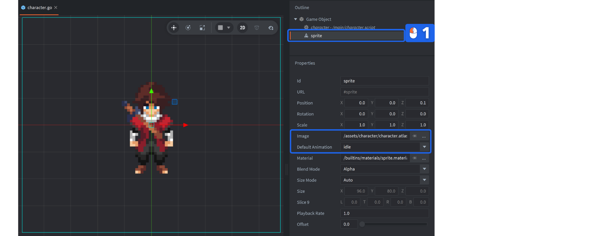

Select the sprite component in the `Outline` and look at its properties:

- `Image` points to ["/main/character.atlas"](defold://open?path=/main/character.atlas)
- `Default Animation` is set to `idle`

The sprite already knows how to play the idle animation. You can preview it by clicking the <kbd>Space</kbd>, when it's selected in the Outline.

But we want the character to move, so we will add the walk animations that the script can switch between.

## Add the walk animations

Open ["/main/character.atlas"](defold://open?path=/main/character.atlas).

An atlas stores separate images and animations. Right now it only contains the `idle` animation - you can select it in the `Outline` and preview with <kbd>View</kbd> ▸ <kbd>Play</kbd> or by clicking <kbd>Space</kbd>.


1. Right click the root of the <kbd>Atlas<kbd> outline and choose <kbd>Add Animation</kbd> (or shortcut<kbd>A</kbd>).
2. Rename the new animation group to <kbd>`left`<kbd> - type it in the <kbd>Properties</kbd> pane in the <kbd>Id</kbd> field, or right-click and select <kbd>Rename</kbd> (shortcut <kbd>F2</kbd>) to edit its name in the Outline directly.

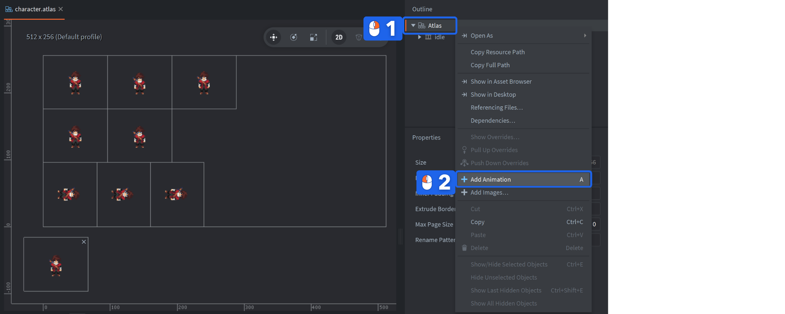

3. Right click the `left` animation and choose <kbd>Add Images...</kbd>.
4. Filter for `left`, select all 8 matching images from `run_left_1` to `run_left_8`, and confirm.
5. Repeat the same process (steps 1-4) for `right`, `front`, and `back`.

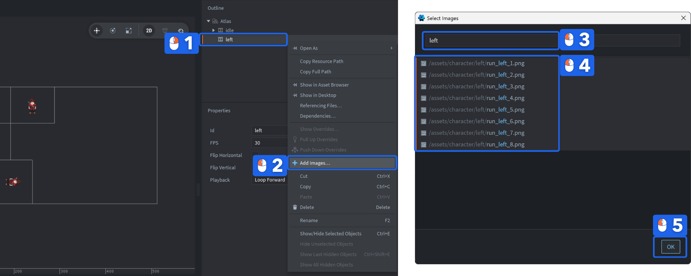

6. You can notice that when you preview the animation (with <kbd>Space</kbd>) it's too fast, so, while holding <kbd>Shift</kbd> select all of the new animations added in the `Outline` and in the `Properties` pane set the <kbd>FPS</kbd> property to <kbd>15</kbd>.

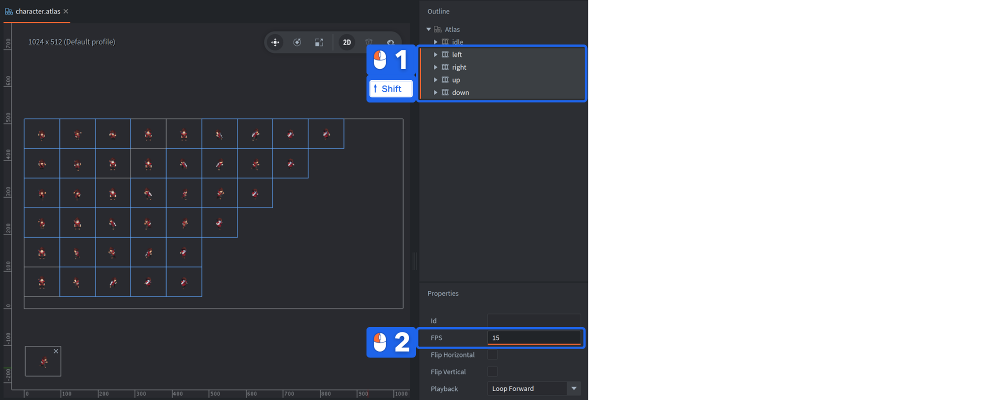

## Saving changes

At the end of the steps in the tutorial, don't forget to save everything. Select <kbd>File</kbd> ▸ <kbd>Save All</kbd> in the top menu or shortcut <kbd>Ctrl</kbd>+<kbd>S</kbd> (<kbd>Cmd</kbd>+<kbd>S</kbd> on Mac)

If the atlas is zoomed out too far, use <kbd>View</kbd> ▸ <kbd>Frame Selection</kbd> (shortcut <kbd>F</kbd>) or scroll to adjust the zooom.

At this point the atlas contains every animation the astronaut needs, but the script still only plays `idle`.

## Open the movement script

Open ["/main/astronaut.script"](defold://open?path=/main/astronaut.script).
You can get back to our character game object and double-click on the character script, or open it using learned methods.

The script will be opened in a built-in code editor, and it includes already the standard script template with empty lifecycle functions. For this tutorial you only need three callbacks:

- `init(self)` runs when the component is created
- `update(self, dt)` runs every frame
- `on_input(self, action_id, action)` receives input actions

So remove the rest.

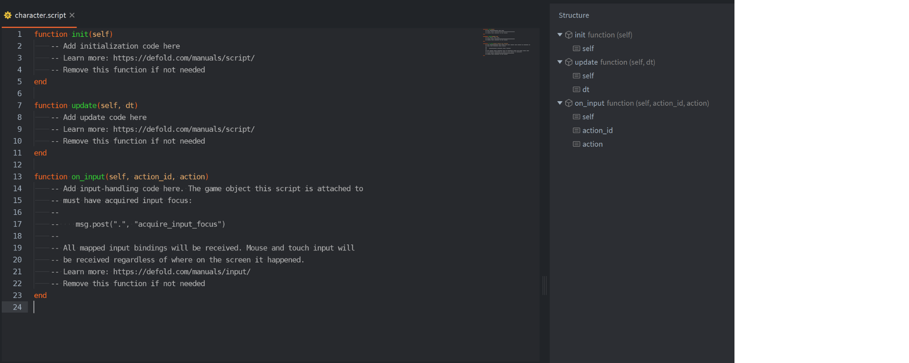

## Initialize the script

Inside the <kbd>`init()`</kbd> function we will initialize needed data and acquire input focus, so write:

```lua
function init(self)
	self.direction = vmath.vector3()        -- a vector of direction
	self.current_animation = hash("idle")   -- initial animation
	msg.post(".", "acquire_input_focus")    -- acquiring input focus
end
```

As you can see, here we have a very simple variables initialization. The <kbd>`self`</kbd> is an instance table that we have available in all lifecycle functions, so inside it we define <kbd>`direction`</kbd> as an empty 3-dimensional vector, and <kbd>`current_animation`</kbd> as our <kbd>`idle`</kbd> animation, but Defold doesn't operates on strings for animations, so we need to make it hashed.

Then we post a message to our current game object (shorthand <kbd>`"."`</kbd>) to <kbd>`acquire_input_focus`</kbd>, meaning, we will now get inputs in <kbd>`on_input`</kbd>.

## Input bindings

Input bindings are already prepared in ["/input/game.input_binding"](defold://open?path=/input/game.input_binding). The four actions you will use are:

- `left`
- `right`
- `up`
- `down`

And those are assigned to the arrow keys. You can look at this, but it's optional now, all is already set up.

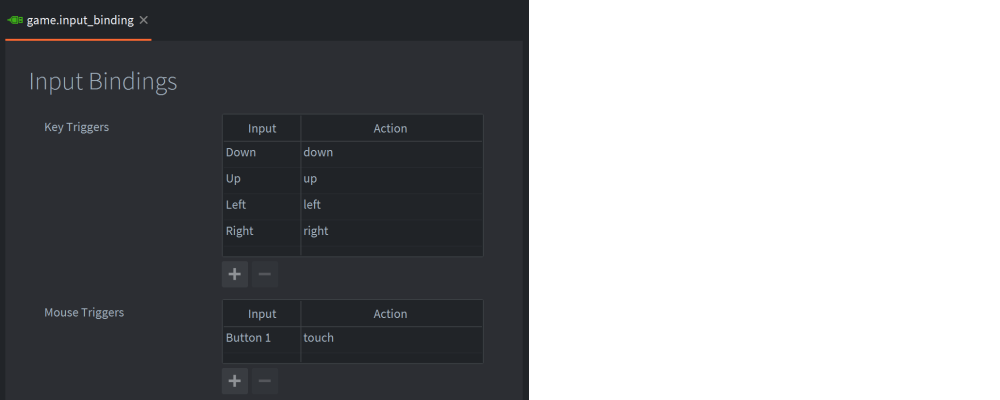

## Make the character move

Now, in our <kbd>`on_input()`</kbd> function write simple `if-else` branches:

```lua
function on_input(self, action_id, action)
	-- Change the direction vector based on current inputs:
	if action_id == hash("up") then
		self.direction.y = -1
	elseif action_id == hash("down") then
		self.direction.y = 1
	elseif action_id == hash("left") then
		self.direction.x = -1
	elseif action_id == hash("right") then
		self.direction.x = 1
	end
end
```

We simply compare here the current <kbd>action_id</kbd> with each of the ones defined in input bindings as <kbd>`actions`</kbd> and modify the <kbd>`direction`</kbd> vector. Each active input action updates one part of the direction vector. If two keys are held at the same time, both axes can be set, which gives diagonal movement.

### Move the game object every frame

And finally in the `update()` function write:

```lua
function update(self, dt)
	-- Get current position of the game object:
	local current_position = go.get_position()

	-- Add to it a direction vector multiplied by speed and delta time:
	local new_position = current_position + self.direction * 150 * dt

	-- Set the new position to the game object:
	go.set_position(new_position)

	-- Reset the direction 
	self.direction = vmath.vector3()
end
```

Comments in the code should explain what we are doing here, so read them carefully. We calculate the new position based on the simple physics movement formula, by taking our current direction vector, that we modify by our inputs, multiplying it by 150, which is the speed value, and then by delta time, which is an amount of a time that passed since last frame update.

You can save it, [build and run the project](defold://project.build).

You are now able to move around, but beside lacking animations, the movement, while holding two keys to move diagonally is too fast, because the direction is not normalized. To fix it, add on the top of our current update function, this code fragment:

```lua
	if vmath.length_sqr(self.direction) > 1 then
		self.direction = vmath.normalize(self.direction)
	end
```

Save and [test the project](defold://project.build).

The diagonal movement is now normalized, so it is not faster than straight movement.

The `150` in the update function is a speed value - such paramaters are good to be defined in the top of the file as local variables:

```lua
local speed = 150
```

and then used in script:

```lua
	local new_position = current_position + self.direction * speed * dt
```

so that you can change them, save it, and Hot Reload the running game, to see the change instantly applied. Read more about [Hot Reloading here](https://defold.com/manuals/hot-reload/).

Play with the speed value to adjust the speed of the movement of the character to its animation.

## Play the correct animation

The astronaut moves now, but the sprite still stays in the <kbd>`idle`</kbd> animation.

To fix it add at the end of our <kbd>`update()`</kbd> function, after setting the position, but just before reseting the direction, this fragment:

```lua
	-- Initialize a local variable to decide which animation we should play:
	local animation = hash("idle")

	-- Depending on the direction vector change it to a proper animation:
	if self.direction.x > 0 then
		animation = hash("right")
	elseif self.direction.x < 0 then
		animation = hash("left")
	elseif self.direction.y > 0 then
		animation = hash("up")
	elseif self.direction.y < 0 then
		animation = hash("down")
	end

	-- If the animation we decided to play is different from the current one playing:
	if animation ~= self.current_animation then
		-- Play the new animation:
		sprite.play_flipbook("#sprite", animation)
		-- and update the variable tracking the current animation:
		self.current_animation = animation
	end
```

Read the comments to understand what the code does. Because we track the currently played animation, the `sprite.play_flipbook()` is only called when the animation changes, so the same animation does not restart every frame. Diagonal movement uses `left` or `right`, simply because those checks run before the vertical ones. If no input is being pressed, it gets back to the default `idle` animation.

[Build and run the project](defold://project.build) again. The character should now both move and animate correctly.

## Limiting the movement space

You'll quickly notice, that we can "stand" on the decorations, like rocks or walls in the tilemap, and we can even move out of the map! You could fix this by checking collisions, and setting up the walls and obstacles collision shapes, but that's for the other tutorial! Right now, let's simply limit the movement, by adding those two lines just before setting the new position in the update loop:

```lua
	-- Limit the position inside a rectangle:
	new_position.x = math.max(100, math.min(570, new_position.x))
	new_position.y = math.max(55, math.min(300, new_position.y))
```

This is enough to have a rectangle area for movement of our character.
And that's the end of the tutorial!

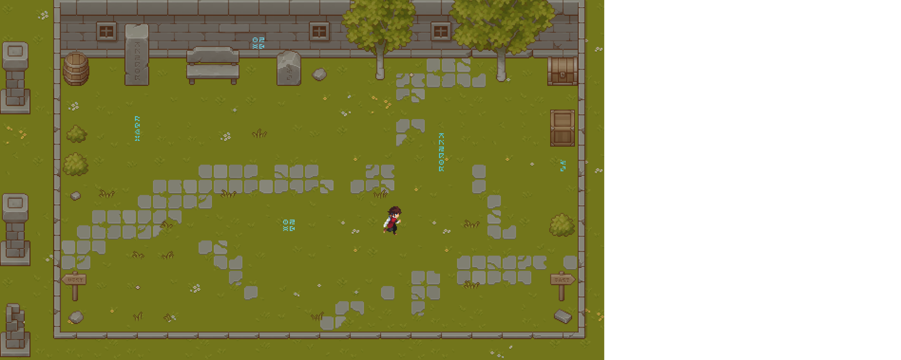

## Final script

Here's how your final version of the script should look like:

```lua
local speed = 150

function init(self)
	self.direction = vmath.vector3()		-- a vector of direction
	self.current_animation = hash("idle")	-- initial animation
	msg.post(".", "acquire_input_focus")	-- acquiring input focus
end

function update(self, dt)
	if vmath.length_sqr(self.direction) > 1 then
		self.direction = vmath.normalize(self.direction)
	end
	-- Get current position of the game object:
	local current_position = go.get_position()

	-- Add to it a direction vector multiplied by speed and delta time:
	local new_position = current_position + self.direction * speed * dt

	-- Limit the position inside a rectangle:
	new_position.x = math.max(100, math.min(570, new_position.x))
	new_position.y = math.max(55, math.min(300, new_position.y))

	-- Set the new position to the game object:
	go.set_position(new_position)

	-- Initialize a local variable to decide which animation we should play:
	local animation = hash("idle")

	-- Depending on the direction vector change it to a proper animation:
	if self.direction.x > 0 then
		animation = hash("right")
	elseif self.direction.x < 0 then
		animation = hash("left")
	elseif self.direction.y > 0 then
		animation = hash("up")
	elseif self.direction.y < 0 then
		animation = hash("down")
	end

	-- If the animation we decided to play is different from the current one playing:
	if animation ~= self.current_animation then
		-- Play the new animation:
		sprite.play_flipbook("#sprite", animation)
		-- and update the variable tracking the current animation:
		self.current_animation = animation
	end

	-- Reset the direction 
	self.direction = vmath.vector3()
end

function on_input(self, action_id, action)
	-- Change the direction vector based on current inputs:
	if action_id == hash("down") then
		self.direction.y = -1
	elseif action_id == hash("up") then
		self.direction.y = 1
	elseif action_id == hash("left") then
		self.direction.x = -1
	elseif action_id == hash("right") then
		self.direction.x = 1
	end
end
```

Also, you can checkout to the `tutorial-done` branch to see the final version of the game from this tutorial.

And that's the end of the tutorial!

## Excercises

You can try the following excersises next:

### Camera follows the character

Make the camera follow the character with a quick trick:

1. Open the ["main.collection"](defold://open?path=/main/main.collection).
2. In the `Outline` drag and drop the <kbd>camera</kbd> game object beneath the <kbd>character</kbd> game object.

This creates a parent-child relationship. Because camera was set to be in the (320,190,0) position in the world, it's now also like this, but related to the `character` position, so modify the position of the `camera` to (0,0,0).

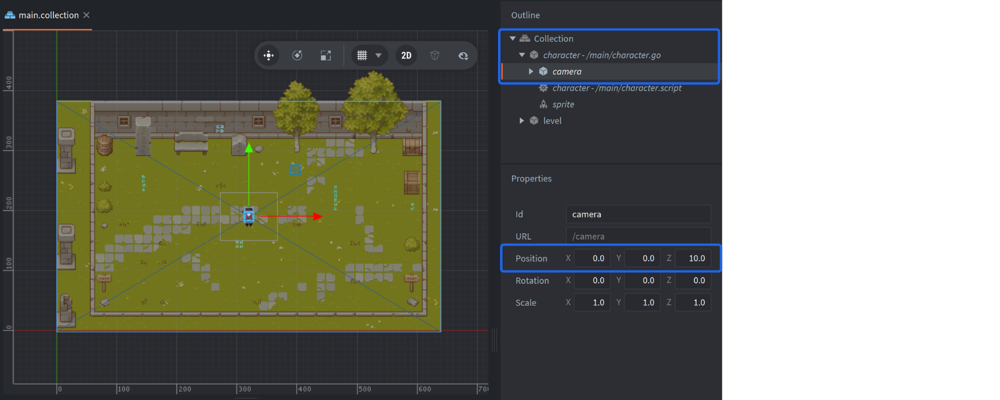

Try the game - now camera strictly follows our character!

### Add WSAD controls

Optionally, if you would like also to control your character with the commonly used `WSAD` keys, define this in the input bindings:

1. Open ["/input/game.input_binding"](defold://open?path=/input/game.input_binding).
2. Add the new bindings in this table - click <kbd>`+`</kbd> icon to add a new binding.
3. Click in the <kbd>Input</kbd> column, type <kbd>`W`</kbd> key to find this input
4. Type <kbd>`up`</kbd> in the <kbd>Action</kbd> column.

Then repeat it for the rest of the keys. Make sure the action names matches the ones defined already, as we will be using those in the code. Read more about [inputs here](https://defold.com/manuals/input/).

### Enlarge the level

You now have a small, but working top down game. Try to expand the level by modifying the ["/main/level.tilemap"](defold://open?path=/main/level.tilemap)! Read more about [tilemaps here](https://defold.com/manuals/tilemap/). 

## What's next?

If you have a game, now you'd usually want to add GUI and switch between levels - try the [Colorslide tutorial](https://defold.com/tutorials/colorslide/) next!

Then you can get back to this and apply the gathered knowledge to add more levels!

For more tutorials and manuals, visit [defold.com/learn](https://defold.com/learn). If you get stuck, ask for help on the [Defold forum](https://forum.defold.com).

## Credits

This project uses the following free art assets:
- Pixel Art Adventurer 2D Top-Down by Mattz Art: [https://xzany.itch.io/top-down-adventurer-character](https://xzany.itch.io/top-down-adventurer-character)
- Pixel Art Top Down Basic tilesets by Cainos: [https://cainos.itch.io/pixel-art-top-down-basic](https://cainos.itch.io/pixel-art-top-down-basic)
